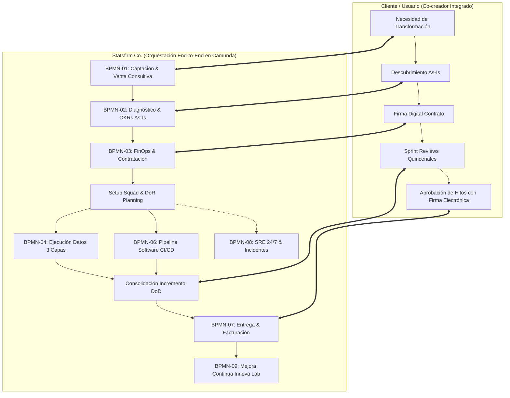

# Especificación Formal de Ingeniería de Procesos BPMN 2.0 (Camunda) — Statsfirm Co.

**Código Documental**: SFC-BPMN-ENG-008  
**Versión**: 1.0  
**Fecha**: Septiembre 2026  
**Fase PDCO**: DEVELOPMENT / CONTROL  
**Estándares Normativos**: OMG BPMN 2.0 (ISO/IEC 19510) | Camunda 7 & 8 Engine Specification | DAMA-BOK | IEEE 830 / ISO 29148  
**Clasificación**: Confidencial / Corporativo y Operaciones  

---

## 1. Resumen Ejecutivo y Arquitectura de Procesos

El presente documento formaliza la ingeniería de procesos de **Statsfirm Co.** modelada bajo el estándar **BPMN 2.0** para su orquestación y visualización en el ecosistema **Camunda** (Camunda Desktop Modeler, Camunda Web Modeler, Zeebe / Camunda Engine y Camunda Tasklist).

El diseño unifica la estructura orgánica de las **Oficinas Estratégicas y de Soporte** ([Documento 03](file:///c:/Users/ADAN/Downloads/Statsfirm/Statsfirm/Statsfirm%20Co%20-%2003.%20Organización%20Empresarial%20y%20Modelo%20Agile.docx)) con la dinámica de ejecución de los **Squads Multidisciplinarios Autónomos** y las 11 fases del marco propietario **Statsfirm Synchronous Transformation Framework (STF)** ([Documento 06](file:///c:/Users/ADAN/Downloads/Statsfirm/Statsfirm/Statsfirm%20Co%20-%2006.%20Metodología%20Propietaria%20de%20Transformación%20Digital.docx)).

---

## 2. Taxonomía de Piscinas (Pools) y Carriles (Lanes) en Camunda

El modelo BPMN maestro (`bpmn/statsfirm_organizacion_procesos.bpmn`) está constituido por 2 Pools colaborativos y 7 Lanes organizacionales:

### Pool 1: `Participant_Cliente` — Cliente / Usuario Final
- **Naturaleza**: Participante externo integrado en modalidad co-creador vía la **App Web & Móvil de Statsfirm Co.** ([Documento 10](file:///c:/Users/ADAN/Downloads/Statsfirm/Statsfirm/Statsfirm%20Co%20-%2010.%20Ecosistema%20Digital%20y%20Especificación%20de%20la%20Aplicación%20del%20Cliente.docx)).
- **Interacciones**: Solicitud de lead, suministro de logs transaccionales, firma digital DPA, asistencia a Sprint Reviews, firma electrónica de conformidad y apertura de incidencias.

### Pool 2: `Participant_Statsfirm` — Statsfirm Co. (Organización Empresarial & Squads)
Estructurado en 7 carriles de especialización funcional:

| Lane ID | Nombre del Carril | Roles Representados | Procesos Canónicos Liderados |
|---|---|---|---|
| `Lane_ComercialFinOps` | Dirección Comercial, FinOps & Legal | Ejecutivo Comercial, Especialista FinOps, Legal Counsel | BPMN-01 (Venta), BPMN-03 (FinOps/Contratos), BPMN-07 (Facturación ERP) |
| `Lane_ProcesosARB` | Arquitectura de Procesos & ARB | Jefe de Procesos (Business Architect), Architecture Review Board | BPMN-01 (Pre-evaluación), BPMN-02 (Diagnóstico As-Is, Process Mining, OKRs) |
| `Lane_GestionAgil` | Gestión Ágil & Producto | Product Owner, Revisor Agile (Scrum Master / Agile Coach) | Planificación DoR, Ceremonias de Sprint, BPMN-07 (Sprint Review Demo) |
| `Lane_DataEngineering` | Data Engineering & Data Governance | Arquitecto de Datos, Data Steward, Ingenieros de Datos | BPMN-04 (Lakehouse Bronze, Silver, Gold), BPMN-05 (Gobernanza & Linaje) |
| `Lane_SoftwareDevOps` | Software Engineering, DevOps & QA | Desarrolladores Software, DevOps/DataOps, QA Engineers, Data Scientist, Analista BI | BPMN-06 (GitFlow, SonarQube CI/CD, K8s Staging, Pruebas QA, DoD) |
| `Lane_OperacionesSRE` | Operaciones SRE & Soporte 24/7 | DevOps / SRE On-Call, CISO, Auditor de Seguridad | BPMN-08 (Telemetría Prometheus/Grafana, Sev 1/2/3, SLA 15min, RCA) |
| `Lane_InnovaLab` | Innova Lab & Mejora Continua | Head of Innova Lab, Transformation Architect | BPMN-09 (Métricas DORA, Retrospectivas, Incubación de Aceleradores STF) |

---

## 3. Fichas de Caracterización de Procesos (SIPOC)

A continuación se especifican las fichas técnicas SIPOC (*Suppliers, Inputs, Process, Outputs, Customers*) de los procesos modelados en Camunda:

### Ficha SIPOC 01: Captación de Clientes y Venta Consultiva (BPMN-01)
- **Objetivo**: Identificar, evaluar preliminarmente y calificar oportunidades de transformación asegurando su viabilidad técnica y alineación metodológica.
- **Suppliers (Proveedores)**: Cliente / Lead entrante, Herramientas de Inbound Marketing, CRM Corporativo.
- **Inputs (Entradas)**: Formulario de requerimientos iniciales (`form_01_lead_comercial.form`), score crediticio/reputacional del CRM.
- **Process (Actividades)**:
  1. Captura de requerimientos iniciales por el Ejecutivo Comercial.
  2. Verificación automatizada de perfil en CRM (`Task_VerificarCRM`).
  3. Evaluación de umbral de calificación (Gateway XOR: Score > 60).
  4. Pre-evaluación técnica por el Jefe de Procesos (`Task_PreEvaluacionViabilidad` - `form_02_evaluacion_viabilidad_arb.form`).
  5. Dictamen del Architecture Review Board (ARB) (`Task_ValidacionARB`).
- **Outputs (Salidas)**: Lead Calificado Aprobado, Topología arquitectónica sugerida, Squad Lead asignado.
- **Customers (Clientes)**: Jefe de Procesos, Dirección Comercial, Cliente.
- **Métricas & SLA**: Tiempo de respuesta comercial < 24 horas; Tasa de conversión de leads calificados > 35%.

---

### Ficha SIPOC 02: Diagnóstico Inicial, Process Mining y OKRs (BPMN-02)
- **Objetivo**: Auditar el estado As-Is de datos, sistemas y procesos del cliente para formular el plan estratégico cuantificable.
- **Suppliers**: Stakeholders de Negocio del Cliente, Administradores de Sistemas del Cliente.
- **Inputs**: Entrevistas con stakeholders, logs transaccionales del cliente, muestras de bases de datos operativas.
- **Process**:
  1. Sesiones de descubrimiento estructurado (STF Fase 1 Discover).
  2. Extracción automatizada de logs y datos de muestra (`Task_ExtraccionLogs`).
  3. Ejecución de algoritmos de Process Mining sobre trazas transaccionales (`Task_ProcessMining`).
  4. Elaboración de matriz de madurez digital y alineación de OKRs (`Task_InformeMadurezOKRs` - `form_03_diagnostico_madurez_okrs.form`).
- **Outputs**: Documento formal de Diagnóstico As-Is, Mapa de Cuellos de Botella, Acuerdos de OKRs firmados.
- **Customers**: Especialista FinOps, Product Owner del Squad, Junta Directiva del Cliente.
- **Métricas & SLA**: Duración de fase de diagnóstico <= 10 días hábiles; Nivel de precisión de cuellos de botella > 90%.

---

### Ficha SIPOC 03: Negociación, FinOps y Formalización Contractual (BPMN-03)
- **Objetivo**: Estructurar el modelo de costos cloud y las garantías jurídicas bajo absoluta transparencia financiera.
- **Suppliers**: Jefe de Procesos (Diagnóstico OKRs), Proveedores Cloud (AWS/Azure/GCP), Dirección Legal.
- **Inputs**: Objetivos OKRs, dimensionamiento de datos (TB), estimaciones de cómputo y almacenamiento.
- **Process**:
  1. Modelado FinOps: cálculo de CAPEX y OPEX mensual cloud (`Task_ModeladoFinOps`).
  2. Generación automatizada del Data Processing Agreement (DPA) con cláusulas GDPR/PII (`Task_GenerarDPA`).
  3. Negociación de términos contractuales y modelo de Squad (`Task_FormalizarContrato` - `form_04_formalizacion_finops_contrato.form`).
  4. Aprobación y firma digital del contrato en la App del Cliente (`Task_Cli_FirmaContrato`).
  5. Activación de proyecto y centros de costos en ERP corporativo (`Task_ActivarERP`).
- **Outputs**: Contrato Legalizado con hash criptográfico SHA-256, DPA suscrito, Proyecto activado en ERP.
- **Customers**: Célula Squad Asignada, Finanzas Statsfirm, Dirección Financiera del Cliente.
- **Métricas & SLA**: Desviación FinOps proyectada vs real < 5%; Tiempo de formalización contractual < 5 días.

---

### Ficha SIPOC 04: Ejecución Canónica de Proyectos de Datos en 3 Capas (BPMN-04)
- **Objetivo**: Ingestar, transformar, gobernar y exponer activos de datos limpios y computables en arquitectura Lakehouse Medallion.
- **Suppliers**: Fuentes operacionales del cliente (ERPs, APIs, Bases de datos, Brokers Kafka, IoT).
- **Inputs**: Archivos planos, eventos streaming, tablas relacionales, Data Contracts.
- **Process**:
  1. *Capa 1 (Bronze Raw)*: Ingesta multiprotocolo batch/streaming y validación sintáctica de esquemas. Si no cumple -> Desvío a Dead Letter Queue (DLQ) con alerta inmediata.
  2. *Capa 2 (Silver Curated)*: Transformación declarativa con dbt y Apache Spark; normalización, limpieza y desduplicación.
  3. *Gobernanza Activa (BPMN-05)*: Validación por el Data Steward (`Task_ValidarGobernanza` - `form_06_gobierno_calidad_dato.form`), control de máscaras PII y registro inmutable de linaje criptográfico.
  4. *Capa 3 (Gold Semantic & Analytics)*: Modelado dimensional analítico, persistencia en Feature Store para modelos de IA y publicación en dashboards de Business Intelligence.
- **Outputs**: Delta Lake / Iceberg Bronze, Silver Curada, Gold Datamarts, Feature Store ML, Tableros Power BI/Looker.
- **Customers**: Científicos de Datos, Analistas BI, Aplicaciones del Cliente, Algoritmos de IA.
- **Métricas & SLA**: Cumplimiento de reglas de calidad > 99.5%; Latencia de ingesta streaming < 1000 ms; 100% de datasets con linaje trazable.

---

### Ficha SIPOC 05: Desarrollo de Software e Integración Continua DevOps (BPMN-06)
- **Objetivo**: Desarrollar microservicios y componentes de interfaz asegurando alta calidad de código y despliegue continuo.
- **Suppliers**: Product Owner (User Stories con Criterios Gherkin), Arquitecto de Software.
- **Inputs**: Historias de usuario validadas bajo Definition of Ready (DoR) (`form_05_sprint_planning_dor.form`).
- **Process**:
  1. Desarrollo de código en ramas de funcionalidad según estándar GitFlow.
  2. Apertura de Pull Request y revisión por pares (Peer Code Review).
  3. Ejecución de pipeline CI automatizado: compilación, pruebas unitarias y análisis estático en SonarQube.
  4. Control de calidad: verificación de cobertura > 80% y 0 vulnerabilidades críticas.
  5. Despliegue automatizado en entorno de Staging (Kubernetes).
  6. Pruebas funcionales E2E por QA Engineer y certificación de Definition of Done (`Task_PruebasQA` - `form_07_qa_signoff_dod.form`).
  7. Continuous Deployment (CD) a ambiente de producción.
- **Outputs**: Release versionado en Git, artefactos en contenedores Docker/OCI, despliegue en producción con monitoreo activo.
- **Customers**: Usuario Final, App Móvil del Cliente, Consumidores de APIs.
- **Métricas & SLA**: Cobertura de pruebas unitarias >= 80%; Falla de despliegue en producción (Change Failure Rate) < 5%.

---

### Ficha SIPOC 06: Entrega, Demostración y Facturación (BPMN-07)
- **Objetivo**: Validar el incremento producido al final del Sprint quincenal y formalizar el cierre comercial del ciclo.
- **Suppliers**: Squad Multidisciplinario (Incremento finalizado con DoD certificado).
- **Inputs**: Release en staging/producción, métricas de calidad de datos, telemetría de sprint.
- **Process**:
  1. Demostración en vivo al Cliente durante la ceremonia de Sprint Review (`Task_SprintReviewDemo`).
  2. Validación de criterios de aceptación por parte del Usuario/Cliente.
  3. Formalización de conformidad mediante firma electrónica avanzada en la App del Cliente (`Task_Cli_FirmaEntrega` - `form_08_aprobacion_entrega_firma.form`).
  4. Disparo automático de la factura electrónica en el ERP (`Task_DispararFactura`).
- **Outputs**: Acta de Sprint firmada digitalmente, Certificado de conformidad, Factura electrónica autorizada.
- **Customers**: Cliente / Stakeholders, Dirección Financiera Statsfirm.
- **Métricas & SLA**: NPS de Sprint >= 8.5/10; Emisión de factura < 15 minutos post-firma de conformidad.

---

### Ficha SIPOC 07: Soporte Técnico 24/7 y Gestión de Incidentes (BPMN-08)
- **Objetivo**: Detectar anomalías proactivamente y resolver fallos operacionales garantizando la disponibilidad del sistema.
- **Suppliers**: Agentes de telemetría Prometheus, Alertas Grafana, Reportes del Cliente desde Consola Web/App.
- **Inputs**: Logs de error, métricas de saturación de CPU/memoria, tickets de incidencias.
- **Process**:
  1. Detección automática por monitoreo continuo o captura de ticket de cliente.
  2. Clasificación algorítmica de severidad: Sev 1 (Crítico), Sev 2 (Mayor), Sev 3 (Menor).
  3. Notificación a guardia SRE On-Call e inicio de ventana de atención (SLA 15 min).
  4. Mitigación técnica, resolución y análisis de causa raíz RCA (`Task_MitigacionIncidente` - `form_09_gestion_incidentes_sev.form`).
  5. Control de escalamiento: si Sev 1 supera 30 minutos sin mitigación -> Notificación de emergencia a Junta Directiva y CISO (`Task_NotificarBoardCISO`).
  6. Cierre del ticket con informe Post-Mortem y acciones preventivas.
- **Outputs**: Incidente resuelto, Reporte Post-Mortem, Actualización de base de conocimiento operativa.
- **Customers**: Usuarios de la plataforma, Cliente corporativo, CISO Statsfirm.
- **Métricas & SLA**: Tiempo de respuesta a Sev 1 < 15 minutos; Disponibilidad de plataforma >= 99.95%; MTTR < 60 min.

---

### Ficha SIPOC 08: Mejora Continua y Aceleradores Innova Lab (BPMN-09)
- **Objetivo**: Capitalizar los aprendizajes de cada Squad para crear aceleradores técnicos y evolucionar el framework STF.
- **Suppliers**: Squads multidisciplinarios, Repositorios de código Git, Herramientas de telemetría DORA.
- **Inputs**: Tiempos de ciclo, métricas DORA (Deployment Frequency, Lead Time, CFR, MTTR), retrospectivas ágiles.
- **Process**:
  1. Recopilación automatizada de métricas operativas al término del Sprint.
  2. Retrospectiva técnica interna del Squad para identificar fricciones recurrentes.
  3. Formulación de propuestas de aceleradores (conectores, plantillas dbt, módulos IaC) (`form_10_acelerador_innova_lab.form`).
  4. Incubación en Innova Lab y actualización de la metodología corporativa STF (`Task_ActualizarMetodologiaSTF`).
- **Outputs**: Nueva versión registrada de STF, Templates de código e infraestructura reutilizables en Innova Lab.
- **Customers**: Nuevos proyectos de Statsfirm Co., Todos los Squads activos, Clientes corporativos.
- **Métricas & SLA**: Reducción de tiempo de configuración en nuevos proyectos > 40%; Adopción de aceleradores > 80%.

---

## 4. Matriz RACI Integral de la Organización Empresarial

La asignación de responsabilidades se alinea estrictamente con el Documento 03 y el marco BPMN:

| Fase / Actividad BPMN | Cliente | PO | Revisor Agile | Jefe Procesos | Arq. Datos / SW | Data Steward | Ing. Datos | Desarrollador | Científico Datos | Analista BI | DevOps / SRE | QA Eng. |
|---|:---:|:---:|:---:|:---:|:---:|:---:|:---:|:---:|:---:|:---:|:---:|:---:|
| **BPMN-01: Prospección & ARB** | A | I | I | **R** | C | I | I | I | I | I | I | I |
| **BPMN-02: Diagnóstico & OKRs** | A | C | I | **R** | C | C | C | I | I | I | I | I |
| **BPMN-03: FinOps & Contratación** | A | C | I | C | C | C | I | I | I | I | C | I |
| **DoR & Sprint Planning** | C | **R** | A | C | C | C | C | C | C | C | C | C |
| **Ingesta Capa 1 Bronze** | I | I | I | I | A | C | **R** | I | I | I | C | C |
| **Curaduría Capa 2 Silver** | I | I | I | I | C | A | **R** | I | C | I | C | C |
| **Gobernanza & Linaje Activo** | I | I | I | I | C | **R** / A | C | I | I | I | I | I |
| **Modelado Capa 3 Gold & BI** | C | I | I | I | C | I | I | I | C | **R** / A | I | C |
| **Desarrollo Software GitFlow** | I | I | C | I | A | I | I | **R** | I | I | C | C |
| **Pipeline CI & SonarQube** | I | I | I | I | C | I | I | C | I | I | **R** | C |
| **Pruebas QA & Certificación DoD** | I | C | C | I | I | I | I | I | I | I | C | **R** / A |
| **BPMN-07: Review Demo & Firma** | **R** / A | C | A | I | I | I | I | I | I | I | I | I |
| **BPMN-08: Gestión Sev 1/2/3** | I | I | I | I | C | C | C | C | I | I | **R** / A | I |
| **BPMN-09: Aceleradores Innova** | I | C | C | **R** | C | I | C | C | C | C | C | I |

*Convención: **R**: Responsable de ejecución | **A**: Aprobador final | **C**: Consultado | **I**: Informado.*

---

## 5. Catálogo Central de Reglas de Negocio en Compuertas Camunda

Las compuertas lógicas (Gateways) del modelo BPMN ejecutan decisiones condicionadas por las siguientes reglas de negocio formales:

| Gateway ID en BPMN | Tipo | Regla de Negocio Asociada | Expresión Lógica / Condición | Camino Positivo | Camino Negativo / Excepción |
|---|---|---|---|---|---|
| `Gateway_CalificaLead` | XOR | **RN-Lead**: Calificación mínima de viabilidad comercial y reputación. | `lead_score >= 60 && presupuesto_usd >= 15000` | Continúa a Pre-evaluación ARB (`Task_PreEvaluacionViabilidad`) | Desvío a Notificación de Rechazo (`Task_NotificarRechazoLead`) |
| `Gateway_AprobacionARB` | XOR | **RN-ARB**: Arquitectura base validada sin inviabilidad tecnológica crítica. | `dictamen_arb == 'aprobado'` | Inicia Diagnóstico As-Is y Sesiones Discover (`Task_SesionesDiscover`) | Descarte formal del proyecto (`EndEvent_LeadRechazado`) |
| `Gateway_DoRValido` | XOR | **RN-DoR**: Historias con criterios Gherkin, esquemas en catálogo y sin dependencias. | `dor_gherkin && dor_esquemas && dor_apis && dor_dependencias` | Apertura de Sprints paralelos Datos + Software (`Gateway_ForkSprints`) | Retorno a Refinamiento de Backlog (`Task_RefinarBacklog`) |
| `Gateway_EsquemaBronze` | XOR | **RN-01 (Integridad de Capas)**: Ningún dato corrupto cruza a persistencia limpia. | `esquema_conforme == true` | Persistencia en Bronze Lakehouse (`Task_PersistenciaBronze`) | Derivación a Dead Letter Queue (DLQ) con alerta inmediata (`Task_DesvioDLQ`) |
| `Gateway_CalidadSilver` | XOR | **RN-02 (Linaje y Calidad)**: Pase a Gold requiere calidad >99.5% y linaje registrado. | `calidad_score >= 0.995 && linaje_registrado == true` | Habilitación de Modelado Dimensional Gold (`Task_ModeladoGold`) | Re-procesamiento con pipeline dbt en Capa 2 (`Task_CuraduriaSilver`) |
| `Gateway_SonarPass` | XOR | **RN-Sonar**: Calidad de software con cobertura >80% y 0 fallos críticos. | `sonarqube_status == 'passed' && cobertura >= 80` | Despliegue en ambiente Staging Kubernetes (`Task_DespliegueStaging`) | Retorno para corrección de código y deuda técnica (`Task_FixCodeQuality`) |
| `Gateway_DoDCertificado` | XOR | **RN-DoD**: Incremento probado de extremo a extremo sin regresiones funcionales. | `dod_aprobado == true && bugs_bloqueantes == 0` | Despliegue continuo a Producción (`Task_ContinuousDeployProd`) | Corrección inmediata por el desarrollador (`Task_FixCodeQuality`) |
| `Gateway_ClienteConforme`| XOR | **RN-03 (Cierre de Sprint)**: Todo entregable requiere firma del usuario para facturación. | `conformidad_cliente == 'aceptado_total' || conformidad_cliente == 'aceptado_menor'` | Disparo automático de factura electrónica ERP (`Task_DispararFactura`) | Planificación de ajustes para el próximo Sprint (`Task_PlanificarAjusteSprint`) |
| `Gateway_EscaladoBoard` | XOR | **RN-08 (Escalado Sev 1)**: Incidencias críticas no resueltas en 30 min escalan al Board. | `severidad == 'sev_1' && tiempo_resolucion > 30` | Notificación de emergencia a Junta Directiva y CISO (`Task_NotificarBoardCISO`) | Cierre regular de incidente post-mortem (`Task_CierreIncidente`) |

---

## 6. Acuerdos de Nivel de Servicio (SLAs) y Métricas DORA

### 6.1. SLAs Operacionales y de Soporte
- **Sev 1 (Crítico - Caída total o pérdida de datos)**:
  - Tiempo de respuesta inicial: **< 15 minutos**.
  - Tiempo máximo para contención provisional: **< 60 minutos**.
  - Escalado automático a Junta Directiva y CISO si supera: **30 minutos**.
- **Sev 2 (Mayor - Degradación de rendimiento sin caída)**:
  - Tiempo de respuesta inicial: **< 1 hora**.
  - Tiempo de resolución: **< 4 horas**.
- **Sev 3 (Menor - Incidencia cosmética o funcional menor)**:
  - Tiempo de respuesta inicial: **< 4 horas**.
  - Tiempo de resolución: **Próximo Sprint programado**.

### 6.2. Métricas DORA Integradas en el Framework STF (Innova Lab)
- **Deployment Frequency (DF)**: Mínimo 1 despliegue a staging/producción por semana por Squad.
- **Lead Time for Changes (LTC)**: Menor a 48 horas desde commit aprobado hasta staging.
- **Change Failure Rate (CFR)**: Menor al 5% de despliegues que requieren rollback o hotfix.
- **Mean Time to Restore (MTTR)**: Menor a 45 minutos en incidentes de infraestructura cloud.
