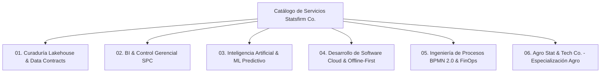

# Módulo 02: Pestañas, Catálogo de Servicios y Soluciones
**Código de Referencia**: `SFC-MKT-FBP-003`  
**Entidad**: Statsfirm Co.  
**Fase PDCO**: PLAN $\rightarrow$ DEVELOPMENT  

---

## 1. Plantilla y Organización de Pestañas en la Fanpage

Para una firma de servicios profesionales de ingeniería y software B2B, la plantilla oficial a seleccionar en la configuración de Facebook es **"Servicios" / "Empresas"**, estructurando el menú de navegación en el siguiente orden de prioridad:

```
[ PESTAÑAS ACTIVAS DE LA PÁGINA STATSFIRM CO. ]
1. Inicio (Feed principal de publicaciones)
2. Servicios (Catálogo estructurado con precios/alcance de consultoría)
3. Información (Datos de contacto, misión, certificaciones)
4. Opiniones / Recomendaciones (Prueba social y testimonios B2B)
5. Eventos (Webinars técnicos, Masterclasses de Innova Lab)
6. Fotos / Videos (Infografías de arquitectura, demos de producto y reels)
7. Comunidad / Grupos (Vinculación con grupos de discusión técnica)
```

---

## 2. Catálogo Oficial de la Pestaña "Servicios"

Cada servicio listado en la pestaña de Facebook debe contar con su imagen representativa (1080x1080 px con fondo `Dark Slate` y diagrama vectorial), descripción concreta y botón directo a agendamiento o WhatsApp:



---

### Servicio 1: Curaduría Lakehouse & Data Contracts (DAMA-BOK)
- **Título**: *Curaduría de Datos & Arquitectura Lakehouse Empresarial*
- **Precio**: *Consultar cotización / Diagnóstico inicial gratuito*
- **Duración**: *Proyectos de 4 a 12 semanas*
- **Descripción**:
  Construcción de arquitecturas modernas de datos en capas Medallion (Bronze, Silver, Gold). Implementamos *Data Contracts* estrictos con validación automatizada en Pydantic/dbt, linaje auditable, esquemas dimensionales en estrella (Kimball) y almacenamiento columnar en Delta Lake/DuckDB/PostgreSQL. Elimina silos y datos inconsistentes.
- **Enlace de Destino**: `https://statsfirm.co/servicios/lakehouse-curaduria`

### Servicio 2: Business Intelligence (BI) & Control Gerencial en Tiempo Real
- **Título**: *Tableros BI Ejecutivos & Control Estadístico de Procesos (SPC)*
- **Precio**: *Consultar cotización*
- **Duración**: *Proyectos de 3 a 8 semanas*
- **Descripción**:
  Diseño e implementación de dashboards estratégicos y tácticos en Power BI, Looker Studio o Apache Superset. Integramos cartas de control Shewhart ($\bar{X}-R$) y monitoreo de variabilidad en tiempo real para directores de operaciones y finanzas. Menos dashboards cosméticos, más decisiones informadas por datos.
- **Enlace de Destino**: `https://statsfirm.co/servicios/bi-analytics`

### Servicio 3: Inteligencia Artificial & Machine Learning Predictivo
- **Título**: *Modelos Predictivos de Demanda, Series de Tiempo y Optimización*
- **Precio**: *Consultar cotización*
- **Duración**: *Fases ágiles de 6 a 16 semanas*
- **Descripción**:
  Desarrollo y despliegue de modelos predictivos de series temporales (pronóstico de demanda, pricing dinámico, anomalías operacionales y mantenimiento predictivo). Modelos explicables con intervalos de confianza del 95%, versionamiento con MLflow y APIs REST de inferencia de baja latencia.
- **Enlace de Destino**: `https://statsfirm.co/servicios/ai-data-science`

### Servicio 4: Ingeniería de Software Cloud & Apps Offline-First
- **Título**: *Desarrollo de Software a Medida & Aplicaciones Móviles Offline*
- **Precio**: *Por Sprint / Modelo Agile STF*
- **Duración**: *Ciclos iterativos de 2 semanas*
- **Descripción**:
  Arquitectura Hexagonal (Ports & Adapters), microservicios en Python/Java y aplicaciones móviles (Flutter/React Native) diseñadas para operar sin conexión a internet (*Offline-First* con SQLite y sincronización CRDT). Código limpio (Clean Code, SOLID, PEP 8) y pruebas unitarias con cobertura $\ge 80\%$.
- **Enlace de Destino**: `https://statsfirm.co/servicios/software-cloud`

### Servicio 5: Ingeniería de Procesos BPMN 2.0 & Farm/Corporate FinOps
- **Título**: *Modelado, Automatización de Procesos BPMN 2.0 & Reducción de Mermas*
- **Precio**: *Consultar cotización*
- **Duración**: *Diagnóstico en 2 semanas / Implementación por fases*
- **Descripción**:
  Mapeo, simulación y orquestación de flujos de trabajo bajo estándar ISO 19510 (BPMN 2.0) con Camunda. Identificación y eliminación de tiempos muertos, cuellos de botella y costos ocultos en cadenas de suministro, plantas industriales y operaciones de campo.
- **Enlace de Destino**: `https://statsfirm.co/servicios/bpmn-finops`

### Servicio 6: Especialización Agroindustrial (Agro Stat & Tech Co.)
- **Título**: *Transformación Agroempresarial Bioestadística (AgroStats)*
- **Precio**: *Diagnóstico de Lote Gratuito*
- **Duración**: *Implementación modular*
- **Descripción**:
  Solución integral para productores agropecuarios y agroexportadores. Control Estadístico de Procesos (SPC) en empaque ($C_{pk} \ge 1.33$), cruce de datos oficiales SIPSA/DANE e IDEAM, y app móvil para cuadrillas de campo sin señal. **Cero venta de sensores ni hardware cautivo.**
- **Enlace de Destino**: `https://statsfirm.co/agro`

---

## 3. Sección de Prueba Social y Reseñas B2B

Para activar la credibilidad de la página de Facebook desde la primera semana:

1. **Protocolo de Recomendaciones**: Invitar a los primeros 10 clientes, socios y colaboradores a dejar una recomendación estructurada que destaque:
   - Cumplimiento de plazos y rigor en las entregas.
   - Retorno de inversión tangible (ej. *“Redujeron un 18% las inconsistencias de datos en nuestro data warehouse”*).
   - Profesionalismo y dominio de los estándares de ingeniería.
2. **Insignias y Sellos de Garantía**: Publicar en las historias destacadas y álbumes las insignias de estándares cumplidos: `DAMA-BOK Standard`, `ISO/IEC 25010 Quality`, `IEEE 830 Specification`, `BPMN 2.0 Certified Workflows`.
