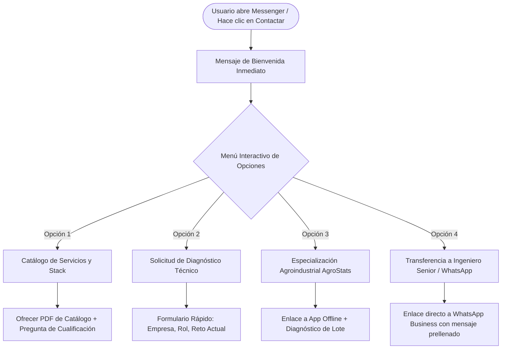

# Módulo 04: Automatización de Facebook Messenger y Bot de Conversión
**Código de Referencia**: `SFC-MKT-FBP-005`  
**Entidad**: Statsfirm Co.  
**Fase PDCO**: PLAN $\rightarrow$ DEVELOPMENT  

---

## 1. Arquitectura del Flujo Conversacional en Messenger

Para maximizar la tasa de respuesta y cualificar prospectos en tiempo real, se configura el sistema de **Respuestas Automáticas en Meta Business Suite** siguiendo un árbol de decisiones estructurado:



---

## 2. Scripts de Automatización en Meta Business Suite

### 2.1. Mensaje de Bienvenida Instantáneo (Instant Reply)
- **Disparador**: Primer mensaje enviado por cualquier usuario en la página.
- **Texto del Mensaje**:
```text
¡Hola {{user_first_name}}! Bienvenido a Statsfirm Co. ⚙️📊

Somos una firma especializada en ingeniería de software, arquitectura de datos (Lakehouse/BI), Control Estadístico de Procesos (SPC) y automatización BPMN 2.0.

¿Cómo podemos apoyar a tu organización hoy? Selecciona una opción del menú interactivo aquí abajo:
```

### 2.2. Menú Persistente de Opciones Rápidas (Quick Replies)

#### [Botón 1] 🛠️ 1. Servicios y Stack Tecnológico
- **Respuesta Automática**:
```text
En Statsfirm Co. estructuramos nuestras soluciones bajo estándares internacionales (DAMA-BOK, ISO 25010, SWEBOK):

🔹 Curaduría de Datos & Lakehouse (Delta Lake, dbt, SQL)
🔹 Business Intelligence & SPC (Power BI, Cartas Shewhart)
🔹 Machine Learning & Series Temporales
🔹 Desarrollo Cloud & Apps Offline-First (Flutter, Python, Java)
🔹 Optimización de Procesos BPMN 2.0 (Camunda)

📥 Puedes descargar nuestro dossier corporativo completo aquí: https://statsfirm.co/servicios
¿Te gustaría hablar con un especialista sobre algún servicio en particular?
```

#### [Botón 2] 📈 2. Solicitar Diagnóstico Técnico Inicial
- **Respuesta Automática**:
```text
Excelente decisión, {{user_first_name}}. Ofrecemos un diagnóstico inicial de madurez técnica sin costo para evaluar:

1. Calidad y gobierno de tus datos actuales (DAMA-BOK).
2. Cuellos de botella y tiempos muertos en tus procesos (BPMN).
3. Viabilidad de migración o modernización de software.

Por favor, compártenos brevemente:
• Nombre de tu empresa:
• Tu cargo:
• ¿Cuál es el principal reto técnico que deseas resolver?

Uno de nuestros ingenieros senior revisará tu caso y te responderá en menos de 2 horas hábiles.
```

#### [Botón 3] 🌱 3. División Agroindustrial (AgroStats)
- **Respuesta Automática**:
```text
A través de Agro Stat & Tech Co. transformamos la productividad y rentabilidad de fincas y agroexportadoras con bioestadística avanzada y control de mermas, ¡sin obligarte a comprar hardware ni sensores costosos! 🚜

📱 Incluye nuestra App Móvil de campo 100% Offline-First.
🌐 Conoce más en: https://statsfirm.co/agro
```

#### [Botón 4] 💬 4. Hablar por WhatsApp
- **Respuesta Automática**:
```text
¡Perfecto! Puedes contactar directamente con nuestra mesa técnica de atención por WhatsApp en un solo clic:

📲 https://wa.me/57XXXXXXXXXX?text=Hola%20Statsfirm,%20vengo%20desde%20Facebook%20y%20deseo%20asesoría%20técnica

Atendemos de Lunes a Viernes de 8:00 AM a 6:00 PM (UTC-5).
```

---

## 3. Preguntas Frecuentes Preconfiguradas (FAQs en Messenger)

| Pregunta Frecuente | Respuesta Automatizada |
|---|---|
| **¿Dónde están ubicados?** | Operamos de manera 100% remota con sede principal en Colombia y cobertura para proyectos en toda América Latina, Estados Unidos y Europa (Zona horaria UTC-5). |
| **¿Venden sensores o hardware para el agro?** | No. Nuestra filosofía es cero dependencia de hardware cautivo. Diseñamos modelos analíticos sobre los datos que tu operación ya genera y sobre fuentes satelitales/oficiales abiertas (DANE, IDEAM, NASA). |
| **¿Cómo garantizan la calidad del software entregado?** | Todo nuestro código sigue principios SOLID, Clean Code, cobertura de pruebas unitarias $\ge 80\%$ y pipelines de CI/CD automatizados bajo estándares ISO/IEC 25010 y SWEBOK. |
| **¿Cuáles son los tiempos promedio de un proyecto?** | Trabajamos con el modelo *Agile STF* en Sprints de 2 semanas. Los diagnósticos iniciales toman entre 5 y 10 días hábiles, y las fases de desarrollo entre 4 y 12 semanas según el alcance. |

---

## 4. Mensaje Fuera de Horario (Away Message)
- **Disparador**: Mensajes recibidos fuera de la franja de 08:00 a 18:00 (UTC-5) o fines de semana.
- **Texto**:
```text
Gracias por escribir a Statsfirm Co., {{user_first_name}}. 🌙
Nuestra oficina técnica se encuentra cerrada en este momento (Horario: Lun-Vie 8:00 AM - 6:00 PM UTC-5).

Hemos recibido tu mensaje y será priorizado a primera hora hábil por nuestro equipo de ingeniería. Si tu solicitud es urgente, puedes dejarnos tu correo o número de WhatsApp aquí mismo.
```
