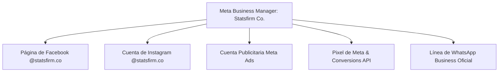

# Módulo 05: Checklist de Lanzamiento, Meta Business Suite y Estrategia de Pauta (Ads)
**Código de Referencia**: `SFC-MKT-FBP-006`  
**Entidad**: Statsfirm Co.  
**Fase PDCO**: PLAN $\rightarrow$ DEVELOPMENT $\rightarrow$ OPERATIONS  

---

## 1. Configuración de Meta Business Suite y Gobierno de Accesos

Para mantener la seguridad corporativa y la administración centralizada de los activos de **Statsfirm Co.**, la página de Facebook debe vincularse estrictamente a un **Meta Business Manager (Administrador Comercial)** oficial:



### Protocolo de Seguridad y Roles:
- **Autenticación en Dos Pasos (2FA)**: Obligatoria para todos los administradores del Business Manager.
- **Verificación de Dominio**: Verificar la propiedad del dominio `statsfirm.co` mediante registro DNS tipo TXT en el proveedor de hosting.
- **Matriz de Permisos Mínimos (Least Privilege)**:
  - *Administrador Comercial*: Solo socios fundadores y CTO.
  - *Editor / Creador de Contenido*: Equipo de Social Media & Diseño (sin permisos de facturación ni eliminación de activos).
  - *Analista de Datos*: Acceso de solo lectura a estadísticas de Meta Business Suite y Pixel.

---

## 2. Integración Técnica del Pixel de Meta y Conversions API (CAPI)

Para medir conversiones reales (descargas de dossiers, solicitudes de diagnóstico y clics a WhatsApp) en la landing page (`landing_page/index.html`), se implementa el **Pixel de Meta** con eventos estándar:

```html
<!-- Meta Pixel Code Oficial - Statsfirm Co. -->
<script>
!function(f,b,e,v,n,t,s)
{if(f.fbq)return;n=f.fbq=function(){n.callMethod?
n.callMethod.apply(n,arguments):n.queue.push(arguments)};
if(!f._fbq)f._fbq=n;n.push=n;n.loaded=!0;n.version='2.0';
n.queue=[];t=b.createElement(e);t.async=!0;
t.src=v;s=b.getElementsByTagName(e)[0];
s.parentNode.insertBefore(t,s)}(window, document,'script',
'https://connect.facebook.net/en_US/fbevents.js');
fbq('init', 'TU_PIXEL_ID_AQUI');
fbq('track', 'PageView');
</script>
<noscript></noscript>
```

### Eventos Estándar a Rastrear:
1. `fbq('track', 'Lead');` $\rightarrow$ Disparado cuando el usuario envía el formulario de diagnóstico.
2. `fbq('track', 'Contact');` $\rightarrow$ Disparado cuando el usuario hace clic en el botón flotante de WhatsApp.
3. `fbq('track', 'ViewContent', {content_name: 'Dossier_Servicios'});` $\rightarrow$ Disparado al descargar el catálogo PDF.

---

## 3. Estrategia de Pauta B2B (Meta Ads) de Alto Retorno

En el sector de ingeniería y servicios corporativos, el presupuesto de pauta debe dirigirse a audiencias de alta especificidad técnica:

```
┌─────────────────────────────────────────────────────────────────────────────┐
│                       ESTRUCTURA DE CAMPAÑAS META ADS                       │
├─────────────────────┬──────────────────────────┬────────────────────────────┤
│ CAMPAÑA 1:          │ CAMPAÑA 2:               │ CAMPAÑA 3:                 │
│ Lead Ads (Formularios│ Retargeting de Tráfico   │ Promoción AgroStats        │
│ Instantáneos)       │ Web (Custom Audience)    │ (Especialización Agro)     │
│ Para Directores TI  │ Visitantes de landing    │ Productores y Jefes de     │
│ & Operaciones       │ que no completaron Lead  │ Empaque de Exportación     │
└─────────────────────┴──────────────────────────┴────────────────────────────┘
```

### 3.1. Campaña 1: Formularios Instantáneos (Lead Generation)
- **Público Objetivo**: Cargos: *Chief Technology Officer (CTO), Director de TI, Gerente de Operaciones, Gerente de Transformación Digital, Jefe de Calidad*.
- **Ubicación Geográfica**: Colombia, México, Chile, Perú.
- **Lead Magnet**: Whitepaper gratuito: *"Guía de Arquitectura Lakehouse y Data Contracts bajo estándar DAMA-BOK"*.
- **Campos del Formulario**: Nombre completo, Correo corporativo, Empresa, Cargo, Reto principal de datos.

### 3.2. Campaña 2: Retargeting con Conversions API
- **Audiencia**: Usuarios que visitaron `statsfirm.co` en los últimos 30 días pero no agendaron diagnóstico.
- **Creativo**: Video testimonio o carrusel de caso de éxito con ROI verificable (*"Cómo redujimos 18% de tiempos muertos con BPMN"*).
- **CTA**: *"Agendar Diagnóstico Gratuito"*.

---

## 4. Checklist de Lanzamiento Previo a Publicar (15 Puntos de Control)

Antes de hacer pública la página y comenzar a emitir contenidos o pauta, verificar los 15 puntos de calidad:

- [ ] **1. Identidad de Página**: Nombre canónico `@statsfirm.co` configurado y verificado.
- [ ] **2. Foto de Perfil**: Isotipo cargado a 800x800 px con zona segura circular respetada.
- [ ] **3. Portada**: Imagen de 1200x675 px con zona segura de 1000x480 px visible tanto en PC como en móvil.
- [ ] **4. Botón de Acción Principal (CTA)**: Configurado y probado hacia WhatsApp Business o URL de contacto.
- [ ] **5. Biografía Corta**: 255 caracteres redactados con propuesta de valor y estándares mencionados.
- [ ] **6. Sección "Información" (About)**: Historia corporativa, datos de contacto, horario y correo corporativo completos.
- [ ] **7. Pestaña Servicios**: Al menos 5 servicios creados con descripción, precios/modalidad y enlaces al portal.
- [ ] **8. Mensaje de Bienvenida en Messenger**: Activado con saludo personalizado y menú de 4 opciones rápidas.
- [ ] **9. Preguntas Frecuentes (FAQs)**: Al menos 4 respuestas automáticas configuradas en Messenger.
- [ ] **10. Mensaje Fuera de Horario (Away)**: Configurado con horario de atención (08:00 - 18:00 UTC-5).
- [ ] **11. Vinculación de Activos**: Cuenta de Instagram `@statsfirm.co` y WhatsApp Business conectados en Meta Business Suite.
- [ ] **12. Dominio Verificado**: `statsfirm.co` verificado vía DNS en el Administrador Comercial.
- [ ] **13. Pixel de Meta & CAPI**: Instalado en `landing_page/index.html` con eventos `Lead` y `Contact` probados en el *Events Manager*.
- [ ] **14. Publicaciones Base**: Al menos 3 publicaciones técnicas iniciales en el feed (1 de presentación, 1 de servicios, 1 caso de estudio) para que la página no luzca vacía al recibir los primeros visitantes.
- [ ] **15. Gobernanza de Roles**: 2FA obligatorio y roles de administrador limitados únicamente a socios y CTO.
