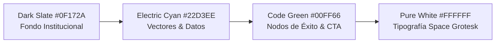

# Plan Maestro de Implementación de la Página de Facebook — Statsfirm Co.
**Código de Referencia**: `SFC-MKT-FBP-001`  
**Entidad**: Statsfirm Co. (Firma Matriz de Ingeniería de Software, Datos & Procesos)  
**Versión**: 1.0.0  
**Fecha**: 2026-09-18  
**Fase PDCO**: **PLAN $\rightarrow$ DEVELOPMENT** | **Active Skill**: `01-requirements` / `02-architecture`  
**Responsable**: Brand Strategy, Digital Marketing & Growth Engineering Practice  

---

## 1. Visión Ejecutiva y Propósito

El presente documento establece el **plan de construcción, configuración técnica, arquitectura de información y estrategia de conversión** para la **Página Oficial de Facebook (Fanpage / Meta Business Suite)** de **Statsfirm Co.**.

Aunque Facebook suele considerarse un canal B2C, en el sector de ingeniería y servicios corporativos B2B cumple tres roles estratégicos insustituibles:
1. **Validación de Confianza e Indexación Digital**: Funciona como un segundo hub corporativo indexado por Google, donde tomadores de decisiones, directores de TI y gerentes de operaciones verifican la solidez, reseñas y actividad real de la firma.
2. **Motor de Captura de Leads Vía Meta Business**: Permite la ejecución de campañas de formularios instantáneos (Lead Ads) de bajo costo por adquisición (CPA) y retargeting avanzado hacia tomadores de decisión agroindustriales y corporativos.
3. **Canal de Automatización y Atención en Tiempo Real (Messenger + WhatsApp)**: Facilita el enrutamiento inmediato de prospectos que solicitan diagnósticos técnicos mediante un bot conversacional estructurado.

```
       [ IDENTIDAD CORPORATIVA ]                 [ INGENIERÍA Y SERVICIOS ]
       Dark Slate (#0F172A), Electric Cyan,      Ingeniería de Datos, Lakehouses, BI,
       Code Green (#00FF66), Pure White          BPMN 2.0, Software Cloud, AI & Data Science
                   \                                   /
                    \                                 /
                     ▼                               ▼
      ┌─────────────────────────────────────────────────────────────┐
      │  PÁGINA OFICIAL DE FACEBOOK: STATSFIRM CO. (@statsfirm.co)  │
      │  "Rigor Matemático, Arquitectura de Datos & Calidad SDLC"   │
      └─────────────────────────────────────────────────────────────┘
```

---

## 2. Mapa de Navegación del Plan

El plan se compone de 5 módulos técnicos y operativos listos para ejecutar:

| # | Módulo | Contenido Principal |
|---|---|---|
| **01** | [`01_configuracion_identidad_pagina.md`](file:///c:/Users/ADAN/OneDrive/Documentos/Statsfirm/Statsfirm/network/01_configuracion_identidad_pagina.md) | Configuración técnica en Meta, Nombres, Categorías, Especificaciones de Avatar y Portada (con zonas seguras de escritorio y móvil), Información de Contacto y Bio de alto impacto. |
| **02** | [`02_secciones_servicios_y_catalogo.md`](file:///c:/Users/ADAN/OneDrive/Documentos/Statsfirm/Statsfirm/network/02_secciones_servicios_y_catalogo.md) | Estructura detallada de la pestaña "Servicios", Catálogo de Soluciones (Data Engineering, BI, AI, Cloud, BPMN), Certificaciones normativas (DAMA, ISO, IEEE) y enlaces al portal web. |
| **03** | [`03_estrategia_contenido_formatos_fb.md`](file:///c:/Users/ADAN/OneDrive/Documentos/Statsfirm/Statsfirm/network/03_estrategia_contenido_formatos_fb.md) | Adaptación de formatos para Facebook (OpenGraph, Álbumes técnicos de arquitectura, Facebook Reels, Eventos para Masterclasses técnicas, Grupos de Comunidad). |
| **04** | [`04_automatizacion_messenger_lead_bot.md`](file:///c:/Users/ADAN/OneDrive/Documentos/Statsfirm/Statsfirm/network/04_automatizacion_messenger_lead_bot.md) | Árbol de decisiones y scripts de respuesta automática para Facebook Messenger / Meta Business Automation (Captura de leads, diagnósticos y FAQs). |
| **05** | [`05_checklist_lanzamiento_y_meta_ads.md`](file:///c:/Users/ADAN/OneDrive/Documentos/Statsfirm/Statsfirm/network/05_checklist_lanzamiento_y_meta_ads.md) | Configuración de Meta Business Manager, integración de Pixel / Conversions API (CAPI), estrategia de pauta para B2B y Checklist de 15 pasos previo al lanzamiento. |

---

## 3. Pilares de Identidad Visual para Facebook (Norma SFC-CORP-ID-LOGOS)



1. **Avatar**: Isotipo oficial en monograma / contenedor squircle sobre fondo `Dark Slate (#0F172A)`.
2. **Portada / Banner**: Composición dual con textura blueprint de ingeniería, titulares de alto contraste y zona segura responsive (820x312 px escritorio / 640x360 px móvil).
3. **Tono de Comunicación**: Consultor senior, analítico, fundamentado en estándares internacionales (SWEBOK, DAMA-BOK, BPMN 2.0).
